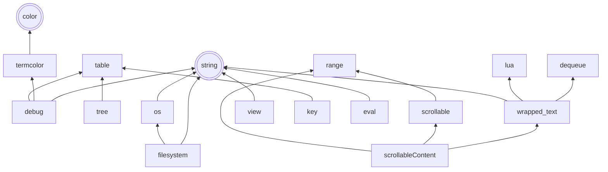

## Full dependencies

```mermaid
%% FULL_START
flowchart RL
  c(((class)))
  co(((color)))
  s(string)
  main --> model.io.redirect
  main --> lib.error_explorer
  main --> model.consoleModel
  main --> controller.controller
  main --> controller.consoleController
  main --> view.view
  main --> view.consoleView
  main --> conf.colors
  main --> host
  main --> util.key
  main --> util.debug
  main --> util.os
  main --> util.filesystem
  main --> util.os
  util.scrollableContent --> util.wrapped_text
  util.scrollableContent --> util.scrollable
  util.scrollableContent --> util.range
  util.scrollable --> util.range
  util.scrollable --> c
  util.tree --> util.table
  util.os --> s
  util.filesystem --> s
  util.filesystem --> util.os
  conf.colors --> co
  conf.colors --> conf.lua
  conf.colors --> conf.md
  harmony.init --> util.filesystem
  harmony.init --> s
  harmony.init --> util.debug
  harmony.init --> lib.hump.timer
  harmony.init --> harmony.scenarios.
  harmony.init --> util.debug
  model.input.inputText --> model.input.cursor
  model.input.inputText --> c
  model.input.inputText --> util.dequeue
  model.input.history --> c
  model.input.history --> util.dequeue
  model.input.history --> s
  model.input.history --> util.debug
  model.input.userInputModel --> model.input.inputText
  model.input.userInputModel --> model.input.selection
  model.input.userInputModel --> model.input.history
  model.input.userInputModel --> model.lang.lua.error
  model.input.userInputModel --> view.editor.visibleContent
  model.input.userInputModel --> c
  model.input.userInputModel --> util.wrapped_text
  model.input.userInputModel --> util.dequeue
  model.input.userInputModel --> s
  model.input.userInputModel --> util.debug
  model.input.userInputModel --> util.lua
  model.input.selection --> model.input.cursor
  model.input.selection --> c
  model.lang.highlight --> c
  model.lang.md.parser --> conf.md
  model.lang.md.parser --> model.lang.lua.parser
  model.lang.md.parser --> model.lang.highlight
  model.lang.md.parser --> s
  model.lang.md.parser --> util.debug
  model.lang.md.parser --> util.dequeue
  model.lang.md.parser --> djot.djot
  model.lang.lua.analyze --> util.tree
  model.lang.lua.error --> c
  model.lang.lua.parser --> model.lang.lua.error
  model.lang.lua.parser --> model.lang.highlight
  model.lang.lua.parser --> conf.lua
  model.lang.lua.parser --> util.debug
  model.lang.lua.parser --> s
  model.lang.lua.parser --> util.dequeue
  model.lang.lua.parser --> metalua.metalua.compiler
  model.lang.lua.parser --> model.editor.content
  model.canvasModel --> util.dequeue
  model.canvasModel --> s
  model.canvasModel --> util.view
  model.canvasModel --> c
  model.canvasModel --> lib.terminal
  model.consoleModel --> c
  model.consoleModel --> model.canvasModel
  model.consoleModel --> model.editor.editorModel
  model.consoleModel --> model.project.project
  conf.lua --> co
  model.interpreter.eval.filter --> c
  conf.md --> co
  model.interpreter.eval.evaluator --> model.interpreter.eval.filter
  model.interpreter.eval.evaluator --> model.lang.highlight
  model.interpreter.eval.evaluator --> c
  model.interpreter.eval.evaluator --> model.lang.lua.parser
  model.interpreter.eval.evaluator --> model.lang.md.parser
  host --> s
  host --> util.os
  util.view --> s
  util.dequeue --> c
  util.wrapped_text --> c
  util.wrapped_text --> util.dequeue
  util.wrapped_text --> s
  util.wrapped_text --> util.lua
  util.termcolor --> co
  util.key --> util.table
  util.eval --> s
  conf --> util.lua
  conf --> harmony.init
  conf --> host
  util.debug --> s
  util.debug --> util.table
  util.debug --> util.termcolor
  util.test_terminal --> s
  util.test_terminal --> lib.terminal
  util.range --> c
  view.input.customStatus --> c
  view.input.statusline --> c
  view.input.userInputView --> view.input.statusline
  view.input.userInputView --> c
  view.input.userInputView --> util.debug
  view.input.userInputView --> util.view
  view.editor.visibleStructuredContent --> view.editor.visibleBlock
  view.editor.visibleStructuredContent --> util.wrapped_text
  view.editor.visibleStructuredContent --> util.range
  view.editor.visibleContent --> model.input.cursor
  view.editor.visibleContent --> util.wrapped_text
  view.editor.visibleContent --> util.scrollable
  view.editor.visibleContent --> util.range
  view.consoleView --> view.titleView
  view.consoleView --> view.editor.editorView
  view.consoleView --> view.canvas.canvasView
  view.consoleView --> view.input.userInputView
  view.consoleView --> c
  view.consoleView --> co
  view.consoleView --> util.view
  view.consoleView --> util.debug
  view.editor.visibleBlock --> util.range
  view.editor.visibleBlock --> s
  view.editor.visibleBlock --> c
  view.editor.bufferView --> model.input.cursor
  view.editor.bufferView --> view.editor.visibleContent
  view.editor.bufferView --> view.editor.visibleStructuredContent
  view.editor.bufferView --> c
  view.editor.bufferView --> util.scrollable
  view.editor.bufferView --> util.table
  view.editor.bufferView --> util.block
  view.editor.search.resultsView --> c
  view.editor.editorView --> view.input.userInputView
  view.editor.editorView --> view.editor.bufferView
  view.editor.editorView --> view.editor.search.searchView
  view.editor.editorView --> s
  view.editor.editorView --> c
  view.editor.search.searchView --> c
  view.editor.search.searchView --> view.editor.search.resultsView
  view.editor.search.searchView --> view.input.userInputView
  view.canvas.canvasView --> view.canvas.bgView
  view.canvas.canvasView --> view.canvas.terminalView
  view.canvas.canvasView --> c
  view.canvas.canvasView --> util.view
  view.canvas.bgView --> c
  model.editor.bufferModel --> model.editor.content
  model.editor.bufferModel --> model.lang.lua.analyze
  model.editor.bufferModel --> model.editor.bufferSemanticInfo
  model.editor.bufferModel --> c
  model.editor.bufferModel --> util.table
  model.editor.bufferModel --> util.range
  model.editor.bufferModel --> s
  model.editor.bufferModel --> util.dequeue
  model.editor.bufferSemanticInfo --> util.table
  model.editor.editorModel --> model.editor.bufferModel
  model.editor.editorModel --> model.editor.searchModel
  model.editor.editorModel --> model.input.userInputModel
  model.editor.editorModel --> c
  model.editor.content --> c
  model.editor.content --> util.dequeue
  model.editor.content --> util.range
  model.editor.searchModel --> c
  model.editor.searchModel --> util.table
  model.editor.searchModel --> util.scrollableContent
  model.project.project --> util.lua
  model.project.project --> s
  model.project.project --> util.filesystem
  model.project.project --> c
  controller.consoleController --> view.input.userInputView
  controller.consoleController --> controller.editorController
  controller.consoleController --> controller.userInputController
  controller.consoleController --> c
  controller.consoleController --> util.eval
  controller.consoleController --> util.filesystem
  controller.consoleController --> util.key
  controller.consoleController --> util.table
  controller.consoleController --> util.test_terminal
  controller.consoleController --> controller.userInputController
  controller.consoleController --> model.input.userInputModel
  controller.consoleController --> view.input.userInputView
  controller.consoleController --> tests.autotest
  model.input.cursor --> c
  controller.searchController --> c
  controller.editorController --> model.interpreter.eval.evaluator
  controller.editorController --> controller.userInputController
  controller.editorController --> controller.searchController
  controller.editorController --> view.input.customStatus
  controller.editorController --> c
  controller.userInputController --> c
  controller.userInputController --> util.key
  controller.userInputController --> s
  controller.controller --> view.view
  controller.controller --> s
  controller.controller --> util.key
  controller.controller --> util.eval
%% FULL_END
```

## Util dependencies

### Tier 0

* `utf`
* `color`

### Tier 1 - general nodep libs

`string` only depends on `utf`

```mermaid
flowchart BT
  s(((string)))
  co(((color)))
  debug --> s
  debug --> termcolor
  tree --> table
  scrollableContent --> wrapped_text
  scrollableContent --> scrollable
  scrollableContent --> range
  scrollable --> range
  filesystem --> s
  filesystem --> os
  view --> s
  debug --> table
  wrapped_text --> dequeue
  wrapped_text --> lua
  wrapped_text --> s
  os --> s
  termcolor --> co
  key --> table
  eval --> s
```
