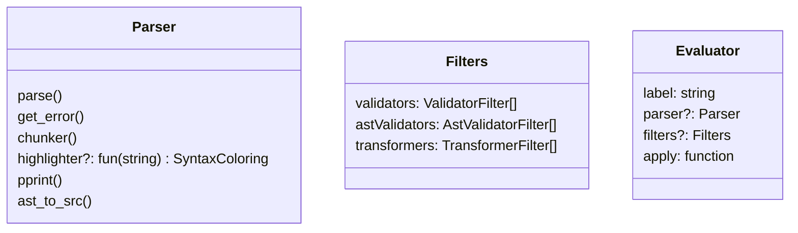
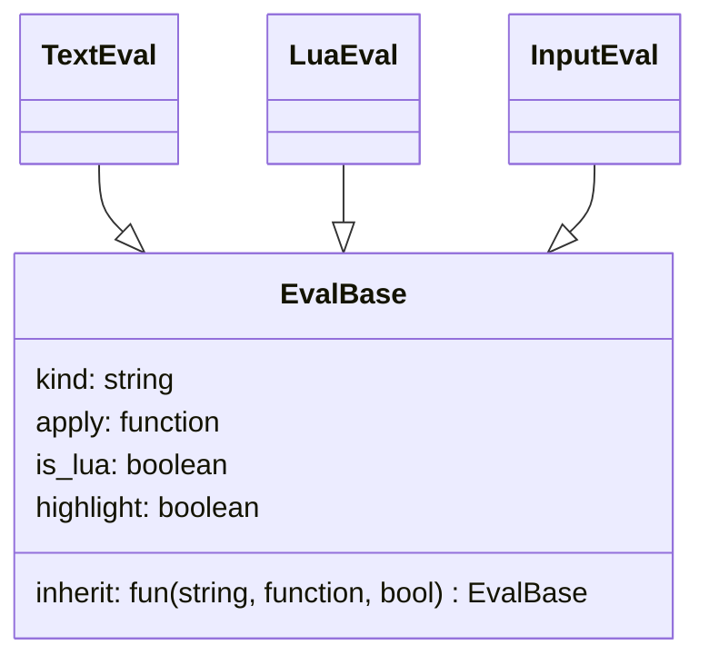
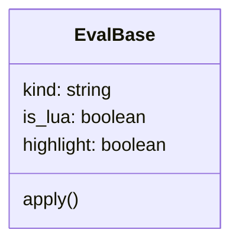

### Planned refactor

```lua
--- @alias validationFilter fun(s: string): boolean, error?
--- @alias conversionFilter fun(s: string): string
--- @alias AstValidatorFilter fun(AST): boolean, error?
--- @alias AstValidatorGen fun(AST, Scope): fun(AST): boolean, error?g
```



|               | hl  | apply |
| :------------ | :-- | :---- |
| LuaEval       | 1   | parse |
| TextEval      | 0   | id    |
| InputEval lua | 1   | noop  |
| InputEval     | 0   | noop  |

### Current



TextEval : no validation, just return it


