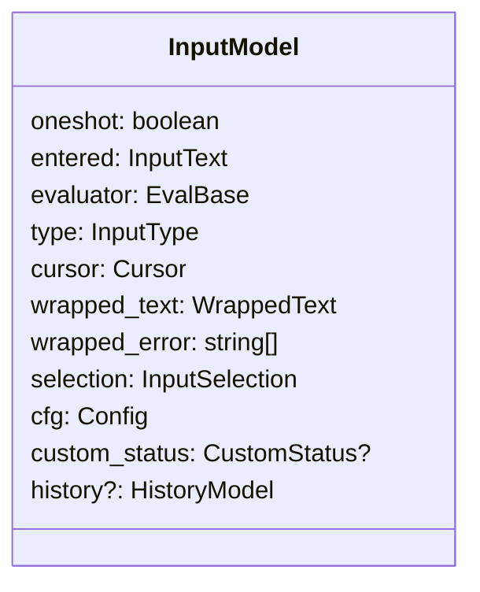

### Planned refactor

Interpreter is out, instead create a History triplet and have
one optionally in the input. If present, invoke.
Evaluation is tightly coupled with the input, no sense having
it separately. Non-validated inputs still can be made with an
'all goes' eval.
