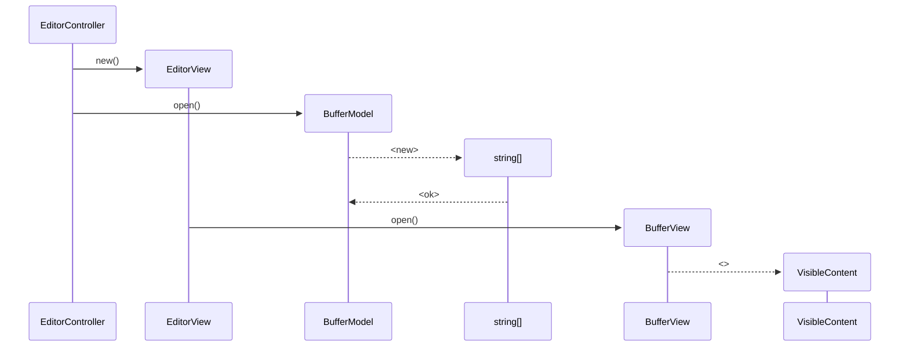
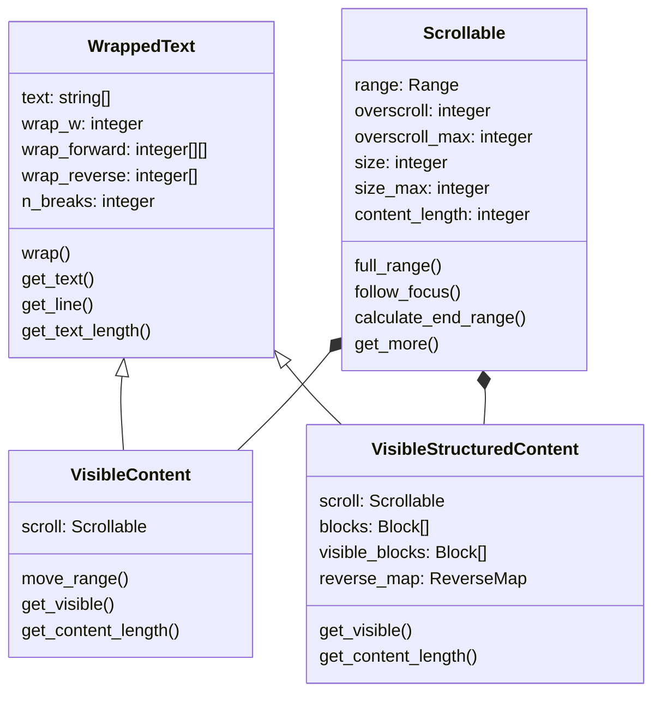
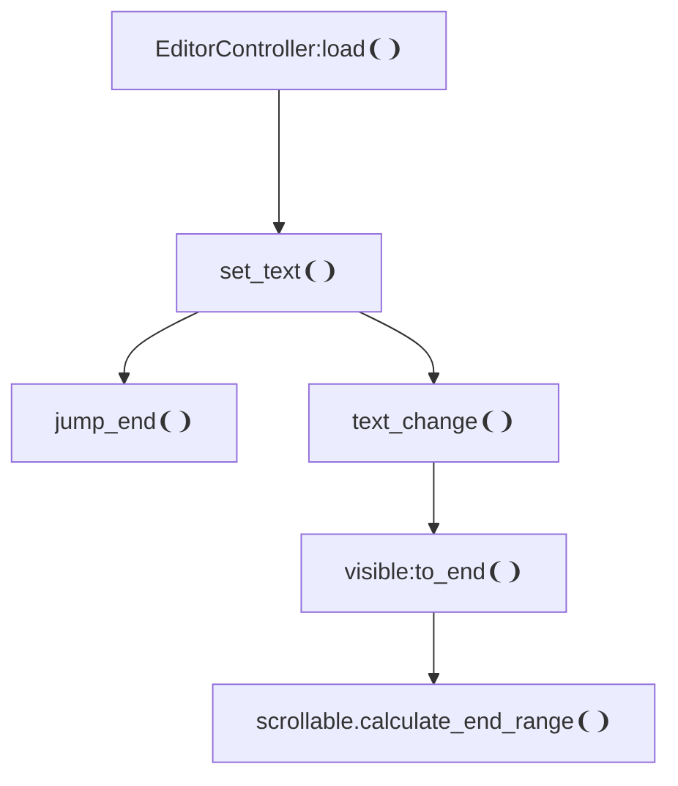
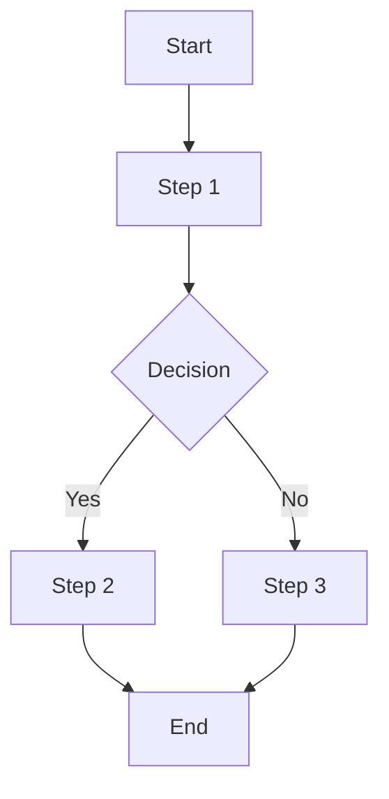

```scala
case class More(
  up: Boolean,
  down: Boolean
)
enum ContentType
  case Plain
  case Lua

enum Block(val tag: String, pos: Range):
  case Empty
  case Chunk(lines: Seq[String])

type Content = Seq[String] | Seq[Block]

class WrappedText(
  text: Seq[String],
  w: Int,
  wrap_forward: Map[Int, Seq[Int]],
  wrap_reverse: Seq[Int],
  n_breaks: Int,
):
  def wrap(text: Seq[String]): Unit
  def get_text(): Seq[String]
  def get_line(): String
  def get_text_length(): Int

class VisibleContent(
  range: Option[Range],
  overscroll: Int, overscroll_max: Int
) extends WrappedText:
  def set_range(r: Range): Unit
  def get_range(): Range
  def move_range(Int): Int
  def get_text(): Seq[String]
  def get_content_length(): Int

class VisibleStructuredContent(
  range: Option[Range],
  blocks: Seq[Block],
  qoverscroll: Int, overscroll_max: Int,
) extends WrappedText:
  def set_range(r: Range): Unit
  def get_range(): Range
  def move_range(Int): Int
  def get_text(): Seq[String]
  def get_content_length(): Int

```

#### plain



### Scrolling



```lua
if content_length < size_max then full_range() end
```

### Input scrolling



##### ex


