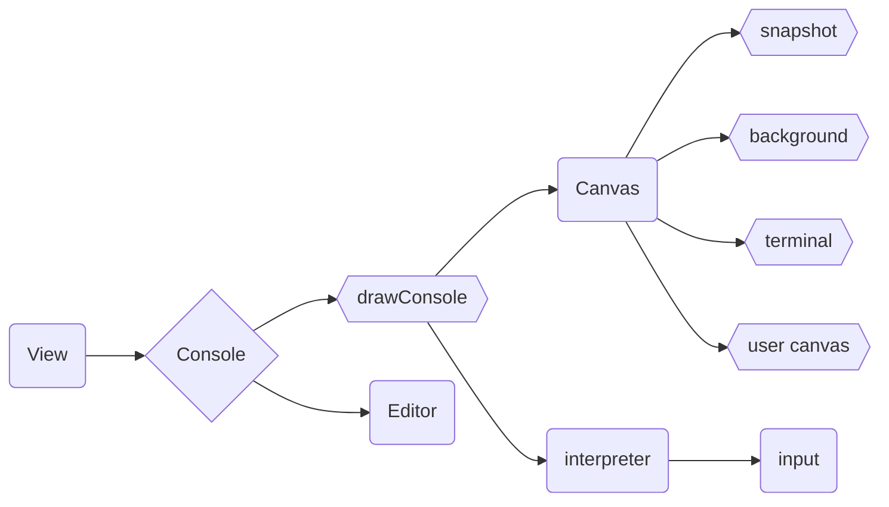

```mermaid
flowchart LR
  V(View) --> C
  C{Console} --> D{{drawConsole}}

  C --> E(Editor)
  D --> c(Canvas)

  c --> x{{snapshot}}
  c --> y{{background}}
  c --> z{{terminal}}
  c --> w{{user canvas}}

  D --> i(interpreter)
  i --> in(input)
```
